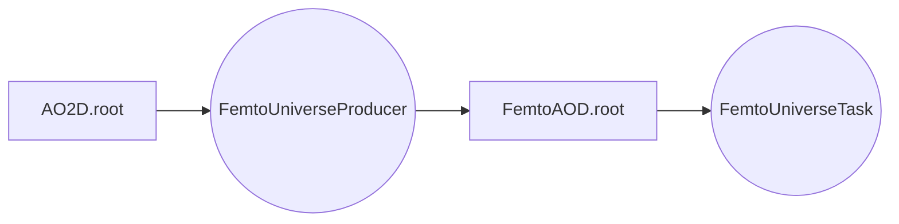

# Welcome to the FemtoUniverse Tasks directory
Here you can find a summary of the tasks and information about who is developing it!

| Task name                                   | What it does?                     | Who is developing it? |
|---------------------------------------------|-----------------------------------|-----------------------|
| femtoUniversePairTaskTrackTrack.cxx         |                                   |                       |
| femtoUniversePairTaskTrackTrackExtended.cxx |                                   |                       |
| femtoUniversePairTaskTrackPhi.cxx           | Angular correlations of h--$\Phi$ | Zuzanna Chochulska    |
| femtoUniversePairTaskTrackV0Extended.cxx    | Angular correlations of h--V0     | Shirajum Monira

> **Note:** If you have any issues or questions feel free to contact us via mattermost ;)

## FemtoUniverse
That's how FemtoUniverse works! You can find the Producer file in the TableProducer directory

